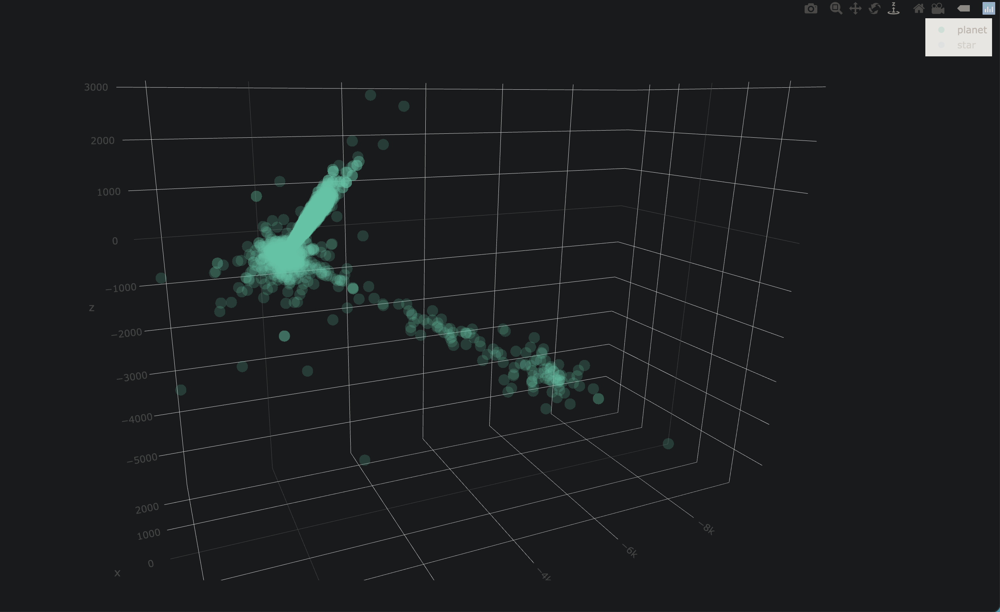
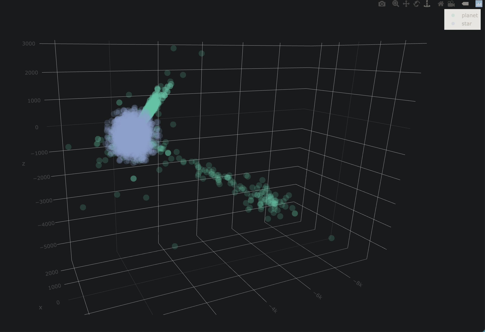

# Brahmir

+ **Brahma** - Brahma is the first god in the Hindu triumvirate, or trimurti.
+ **Ymir** - Ymir is a primeval being in Norse mythology who is the progenitor of all jötnar (giants).

## What is this?

This is a project (written in R) aimed at cleaning and processing several
datasets of nearby stars and exoplanets into a single normalized dataset.

## Images

### Planets only



### Planets and Stars



## Source Data

In the `source_data` folder, you will find the following:

+ `hygdata_v3.csv` - A dataset of roughly 100,000 nearby stars [Link](https://www.astronexus.com/hyg)

+ `exoplanet.eu_catalog.csv` - Dataset of all ~4300 exoplanets [Link](http://exoplanet.eu/catalog/)

## Running the code

Install `R` and install required packages:

```{r}
install.packages(c("dplyr", "celestial", "nabor", "plotly"))
```

Run the code in `process_data.R`.

## Output Format

The code outputs two semicolon-delimited files:

+ `stars.csv`
+ `planets.csv`

## Sample Output

+ [./output/samples/stars.csv](./output/samples/stars.csv)
+ [./output/samples/planets.csv](./output/samples/planets.csv)
